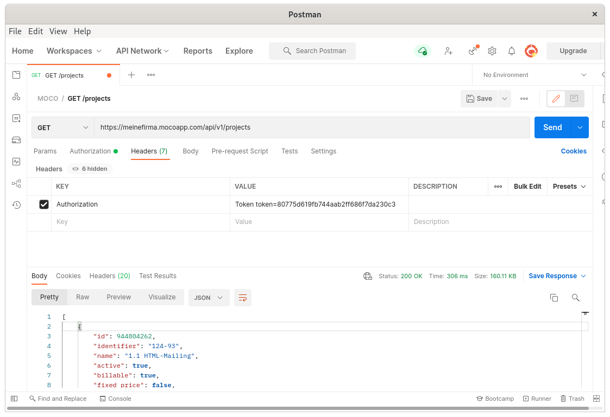

# Moco API Documentation

This is the official API documentation for mocoapp.com (👉 [we are hiring](https://www.mocoapp.com/unternehmen/jobs)).

<!-- TOC depthfrom:2 -->

- [General](#general)
- [Entities](#entities)
- [Authentication](#authentication)
- [Postman example](#postman-example)
- [Client Implementations / API Wrappers](#client-implementations--api-wrappers)
- [Impersonation](#impersonation)
- [Rate Limiting](#rate-limiting)
- [Pagination](#pagination)
- [Errors and HTTP status codes](#errors-and-http-status-codes)
- [Sorting](#sorting)
- [Custom Fields](#custom-fields)
- [WebHooks](#webhooks)
  - [Calculating the signature](#calculating-the-signature)
  - [Notes](#notes)

<!-- /TOC -->

## General

- Request payloads to MOCO must be sent as valid JSON with a mandatory `Content-Type: application/json`-header. Responses are also sent as JSON.
- All requests have to be [authenticated](#authentication) with a user-specific key
- Example responses showcase the happy case, i.e. usually the `200 OK` response
- Collections are usually [paginated](#pagination)
- Zapier triggers are **not** triggered for API requests
- Timestamps `created_at` and `updated_at` are sent for all entities in UTC, as ISO8601 format.
- For synchronization almost all resources can be filtered by `updated_after` passing a time in UTC, as ISO8601 format.
- MOCO does not support any client-libraries at the moment. However, there are currently the following unofficial clients available, which you can use at your risk: [Python Client](https://github.com/sommalia/moco-wrapper)

## Entities

All the entities exposed via the API can be found in their respective sections.

- [Account / Catalog Services](sections/account/catalog_services.md)
- [Account / Custom Properties](sections/account/custom_properties.md)
- [Account / Fixed Costs](sections/account/fixed_costs.md)
- [Account / Hourly Rates](sections/account/hourly_rates.md)
- [Account / Internal Hourly Rates](sections/account/internal_hourly_rates.md)
- [Activities](sections/activities.md)
- [Comments](sections/comments.md)
- [Companies](sections/companies.md)
- [Contacts](sections/contacts.md)
- [Deal Categories](sections/deal_categories.md)
- [Deals / Leads](sections/deals.md)
- [Invoice Payments](sections/invoice_payments.md)
- [Invoice Reminders](sections/invoice_reminders.md)
- [Invoices](sections/invoices.md)
- [Offers](sections/offers.md)
- [Planning Entry (New Planning)](sections/planning_entries.md)
- [Project Contracts](sections/project_contracts.md)
- [Project Expenses](sections/project_expenses.md)
- [Project Payment Schedules](sections/project_payment_schedules.md)
- [Project Recurring Expenses](sections/project_recurring_expenses.md)
- [Project Tasks](sections/project_tasks.md)
- [Projects](sections/projects.md)
- [Purchase Categories](sections/purchase_categories.md)
- [Purchase Drafts](sections/purchase_drafts.md)
- [Purchase Payments](sections/purchase_payments.md)
- [Purchases](sections/purchases.md)
- [Receipts](sections/receipts.md)
- [Schedules (Absences)](sections/schedules.md)
- [Tags / Labels](sections/tags.md)
- [Units / Teams](sections/units.md)
- [User Employments](sections/employments.md)
- [User Holidays](sections/holidays.md)
- [User Presences](sections/presences.md)
- [User Work Time Adjustments](sections/work_time_adjustments.md)
- [Users](sections/users.md)
- [Vat Codes](sections/vat_codes.md)
- [WebHooks](sections/web_hooks.md)
- [Reports](sections/reports.md)

## Authentication

You need an API key for authentication. Each user can find their user-specific key on mocoapp.com on their profile in the "Integrations" tab. This key is provided as an Authorization header.

```bash
curl -X GET \
  'https://{domain}.mocoapp.com/api/v1/projects.json' \
  -H 'Authorization: Token token=YOUR_API_KEY'
```

This key can also be requested via API:

```bash
curl -X POST \
  https://{domain}.mocoapp.com/api/v1/session \
  -H 'Accept: application/json' \
  -H 'Content-Type: application/json' \
  -d '{
    "email": "max@muster.de",
    "password": "secret"
  }'
```

It's also possible to verify if the API key is still valid:

```bash
curl https://{domain}.mocoapp.com/api/v1/session \
  -H 'Accept: application/json' \
  -H 'Content-Type: application/json'
```

If the key is valid, the response code id `200 ok` and the body is:

```json
{
  "id": 123,
  "uuid": "aec324a2-4832-11eb-b378-0242ac130002"
}
```

otherwise the response code is `401 unauthorized`.

## Postman example

There are a few tools to try out the MOCO API. All the examples in this documentation use `curl` to demonstrate the API endpoint.
A popular graphical UI for REST is [Postman](https://www.postman.com/). Here's an example request for the projects list including the authentication:



## Client Implementations / API Wrappers

Here's a list of API client implementations, not maintained by us. Feel free to open up a PR to point to your implementation so others can re-use it.

| Language |                Repository                |
| -------- | :--------------------------------------: |
| Python   | https://github.com/sommalia/moco-wrapper |

## Impersonation

By default all requests are scoped to the authenticated user. Some resources cannot be written in behalf of other users like `Activities` and `User Presences`. This reflects the behaviour in the UI. But you can login as another user provided that the authenticated user has permission to _Staff_. To achieve the same behaviour in the API, one can set the following x-header:

`X-IMPERSONATE-USER-ID=123` (user id to act in behalf of)

## Rate Limiting

You can expect to be able to fire 15 requests within a time frame of 15 seconds. If you exceed this limit, the server responds with `429 Too Many Requests`.

## Pagination

Responses are paginated with a common default of 100 entries per page. In the HTTP response header, the current page, the entries per page and the number of total entries is reported. There is also a link header to links to the consecutive page.

- **X-Page** – 3
- **X-Per-Page** – 100
- **X-Total** – 415
- **Link** – `<https://{domain}.mocoapp.com/api/v1/projects.json?page=4>; rel="next"`

If there is not Link header with `rel="next"`, the current page is the last page.

## Errors and HTTP status codes

The MOCO-API is mostly conformant with the [general HTTP status codes](https://en.wikipedia.org/wiki/List_of_HTTP_status_codes).

Here are the most comment errors you will see:

- **401 Unauthorized** - Check the error message in the response body
- **403 Forbidden** - Check your [Authentication](#authentication) or your MOCO user permission
- **404 Not Found** - Check that resource exists (maybe it was deleted in the meantime)
- **422 Unprocessable Entity** - Check the provided error message in the response body
- **429 Too Many Requests** - Check [Rate Limiting](#rate-limiting)

## Sorting

Sorting is controlled by the `sort_by` query parameter. Its value is the field name that should be sorted, followed by an optional sorting order (`asc` or `desc`, default is `asc`).

Example:

- `https://{domain}.mocoapp.com/api/v1/offers?sort_by=title desc`

## Custom Fields

MOCO supports adding custom fields to many of its resources. These custom fields are readable and writable via the `custom_properties` field.

```json
"custom_properties": {
    "UID": "123-UID-456",
    "Line of business": "Automotive"
},
```

Parameters are sent with their name as key:

```bash
curl -X POST \
  https://{domain}.mocoapp.com/api/v1/customers \
  -H 'Authorization: Token token=YOUR_API_KEY' \
  -H 'Content-Type: application/json' \
  -d '{
    "name": "Beispiel AG",
    "currency": "CHF",
    "custom_properties": {
      "Line of business": "Automotive"
    }
  }'
```

All values are encoded as strings, expect for Multiple Choice, which is encoded as an array.

```bash
curl -X POST \
  https://{domain}.mocoapp.com/api/v1/customers \
  -H 'Authorization: Token token=YOUR_API_KEY' \
  -H 'Content-Type: application/json' \
  -d '{
        "custom_properties": {
          "Line of business": ["Automotive", "Banking"]
        }
      }'
```

- Single-line input – "Automotive"
- Mehrzeilige Eingabe – "A multiline input..."
- Link – "https://www..."
- Date – "2021-12-31"
- Yes/No – "0", "1" (0 = No, 1 = Yes)
- Single choice – "Value"
- Multiple choice – ["Value 1", "Value 2"]

⚡ **WARNING** ⚡: If you use custom fields, all of them have to be provided. If not, any that are not transmitted will be removed.
